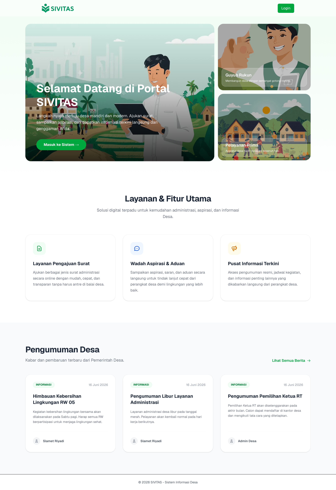

# 🍃 SIVITAS — Portal Administrasi & Informasi Desa

SIVITAS adalah aplikasi web modern yang membantu mendigitalisasi layanan administrasi desa dan pusat informasi publik. Pengguna (warga) dapat dengan mudah mengakses layanan kependudukan, sementara perangkat desa dapat mengelola data, memproses surat, dan menyiarkan pengumuman secara *real-time* melalui satu pintu yang terintegrasi.

---

## 📸 Screenshot

---

## ✨ Features

🔹 **Sistem Registrasi Hierarkis:** Pendaftaran warga dengan validasi data wilayah (RT, RW, Dusun) yang terstruktur.
🔹 **Dashboard & Role Management:** Akses antarmuka yang berbeda antara Warga biasa dan Admin/Perangkat Desa.
🔹 **Pusat Informasi Terkini:** Papan buletin digital untuk pengumuman resmi dan agenda desa.
🔹 **Manajemen Pengajuan Surat:** Sistem untuk memproses dan melacak status permohonan administrasi warga (Coming Soon).
🔹 **Responsive UI:** Pengalaman pengguna yang mulus di *desktop* maupun perangkat *mobile* dengan transisi halus (Framer Motion).
🔹 **Keamanan Data:** Proteksi rute dinamis dan manajemen *state* yang aman.

---

## 🧰 Tech Stack

**Frontend:** Next.js 15 (App Router), React, Tailwind CSS v4, Framer Motion
**Backend:** Next.js Server Actions, Prisma ORM
**Database:** PostgreSQL / MySQL (Via Prisma)
**Tools:** ESLint, TypeScript, Lucide Icons

## AKUN TEST
ROLE DUKUH = 3201011990000001 | dukuh12026
ROLE WARGA = 3201011990000012 | warga92026

## 📖 Latar Belakang (Background)

Proyek ini berawal dari pengalaman observasi langsung di lapangan saat saya mengikuti program Kuliah Kerja Nyata (KKN) di Desa Dlingo, Kabupaten Bantul. Selama program berlangsung, saya mendengarkan langsung keluhan dari para Kepala Dukuh mengenai proses pendataan warga dan administrasi desa yang masih konvensional, memakan waktu, dan rawan ketidaksinkronan data. Berangkat dari permasalahan nyata tersebut, SIVITAS dibangun. Aplikasi ini dirancang khusus untuk mempermudah tugas perangkat desa—khususnya para Dukuh—dalam mengumpulkan, memantau, dan mengelola data kependudukan secara digital dan terpusat, sehingga pelayanan desa menjadi jauh lebih cepat, akurat, dan efisien.